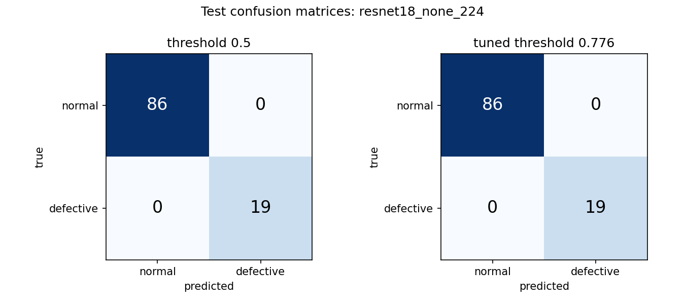

# Visual Defect Detection (normal vs defective)

This project classifies cast metal parts as normal or defective and serves the model as an API. The model is a ResNet-18 fine-tuned from ImageNet weights, exported to ONNX and served with FastAPI and ONNX Runtime on CPU. The decision threshold is 0.776, chosen on validation to reach at least 95% recall.

The client's dataset was not provided, so everything here uses a public Kaggle casting dataset as a stand-in (700 images, 18% defective). Nothing below says anything about the client's data.

On the held-out test set (105 images, 19 defective) the model finds all 19 defects with no false alarms. With only 19 defects, a true recall as low as 0.82 is still possible, so I put more weight on cross-validation (595 images): recall 0.981 and precision 0.938 at the deployed threshold (measured on five fold models, not on the deployed model itself).

More detail: [docs/api.md](docs/api.md) (API reference), [docs/production.md](docs/production.md) (production notes), [docs/architecture.md](docs/architecture.md) (diagram), [reports/error_analysis.md](reports/error_analysis.md) (what goes wrong).

## Quickstart

With Docker. `artifacts/model.onnx` and `artifacts/model_meta.json` are in the repo.

```bash
docker compose up --build
curl -s http://localhost:8000/ready
```

Without Docker (Python 3.11, inference dependencies only, no torch):

```bash
python -m venv .venv && source .venv/bin/activate    # Windows: .venv\Scripts\activate
pip install -r requirements-inference.txt
python tasks.py serve                                 # http://127.0.0.1:8000
```

Tests (this needs torch, so install the full requirements):

```bash
pip install -r requirements.txt
python tasks.py test
```

`tasks.py` is the only task runner; `python tasks.py` lists the tasks. Only `test` and `serve` have been run through it. The other tasks were run as direct script calls.

## API in brief

```bash
curl -s -X POST http://localhost:8000/predict -F "file=@examples/images/01_defect_correct_cast_def_0_7896.jpeg;type=image/jpeg"
```

A real response (first row of [examples/predictions.json](examples/predictions.json)):

```json
{"predicted_class": "defective", "confidence": 0.9999651908874512, "defect_probability": 0.9999651908874512,
 "threshold_used": 0.7760080151863646, "model_version": "20261007-004422_resnet18_none_224-0f824ffa",
 "latency_ms": 29.0, "request_id": "bd2a68a156804e8c8ee45d5bdfd3a1d1",
 "input_quality": {"ok": true, "warnings": [], "metrics": {"mean_brightness": 140.8, "sharpness": 162.21}}}
```

`defect_probability` is the probability of the defective class. The answer is `defective` when it is at least `threshold_used` (0.776, not 0.5). Endpoints, fields, error codes and settings are in [docs/api.md](docs/api.md).

## Dataset strategy

The stand-in is the Kaggle "Casting product image data for quality inspection" dataset: 6,000 JPEGs (3,000 normal, 3,000 defective). All are 300x300, all are grayscale stored as RGB, none is corrupt, and there is no train/test split ([reports/dataset_inspection.txt](reports/dataset_inspection.txt)). I drew 700 images with seed 42 to get an imbalanced set: 574 normal and 126 defective, 18.0% ([reports/dataset_summary.json](reports/dataset_summary.json)).

Perceptual hashing alone did not work. Every image shows the same part in the same pose, so hashes of different parts are close. With pHash at Hamming distance <= 4, 4,166 of the 6,000 images (69%) were flagged and chained into one group of 2,280. Now pHash only proposes pairs (distance <= 8), and a pixel RMSE check on 64x64 thumbnails (<= 3.0) confirms each pair. Groups are the connected components of the confirmed pairs.

| setting | groups | images in groups | largest group | groups mixing both classes |
|---|---|---|---|---|
| pHash only, Hamming <= 4 | 480 | 4,166 | 2,280 | 30 |
| pHash only, Hamming <= 8 | 31 | 5,799 | 5,712 | 2 |
| pHash <= 8 + RMSE <= 3 (used) | 51 | 103 (1.7%) | 3 | 0 |

There are no byte-identical duplicates. The RMSE limit of 3.0 is a judgement call, because the pixel distances form a continuum (the sweep for 1, 2 and 5 is in the same report). Only 11 of the 700 images belong to a source duplicate group and none has its partner in the subsample, so the group-aware split never had to separate real duplicates here. It is unit-tested with synthetic groups ([tests/test_splits.py](tests/test_splits.py)).

The split uses `StratifiedGroupKFold`: 20 folds are assigned to train, val and test (70/15/15), keeping the best of 10 seeded passes. The 5 CV folds are a second group-aware split of train+val, so the test set is never part of CV. Normalisation statistics come from the train split only.

| split | normal | defective | defective % |
|---|---|---|---|
| train | 402 | 88 | 18.0 |
| val | 86 | 19 | 18.1 |
| test | 86 | 19 | 18.1 |

## Model approach

With 490 training images, starting from ImageNet weights makes sense. ResNet-18 (11.2M parameters) fine-tunes on CPU and exports cleanly to ONNX. Training has two stages: the new head alone (2 epochs, lr 1e-3), then all layers (up to 8 epochs, lr 1e-4, cosine schedule), with AdamW and early stopping on validation PR-AUC. Augmentation is flips, rotation up to 15 degrees and mild brightness/contrast jitter. I left out hue and saturation jitter, and crops, because a crop could cut off a defect at the edge ([reports/training_runs.md](reports/training_runs.md)).

| run | params (M) | val PR-AUC | test PR-AUC | test recall / precision at the run's own validation-tuned threshold |
|---|---|---|---|---|
| resnet18, no handling, 224 px (chosen) | 11.18 | 1.000 | 1.000 | 1.000 / 1.000 |
| resnet18, no handling, 300 px | 11.18 | 1.000 | 1.000 | 1.000 / 1.000 |
| efficientnet_b0, no handling, 224 px | 4.01 | 1.000 | 1.000 | 1.000 / 1.000 |
| resnet18, weighted loss, 224 px | 11.18 | 1.000 | 1.000 | 1.000 / 1.000 |
| resnet18, balanced sampler, 224 px | 11.18 | 1.000 | 0.997 | 0.947 / 0.947 |
| logistic regression, 64x64 pixels (baseline) | <0.01 | 0.949 | 0.972 | 1.000 / 0.594 |

Source: [reports/model_comparison.md](reports/model_comparison.md). The pixel baseline already reaches 0.972 test PR-AUC, so this stand-in is easy.

The imbalance comparison is inconclusive. No handling, weighted loss and a balanced sampler all reach validation PR-AUC 1.000 and recall 1.000 on 105 validation images (19 defective), so validation cannot rank them. I chose no handling on the last tie-break only (validation log-loss 0.0071, against 0.0418 for weighted loss and 0.2385 for the sampler). The one visible difference is calibration: test precision at threshold 0.5 is 1.000 (none), 0.950 (weighted) and 0.655 (sampler). ResNet-18 at 224 px won over the 300 px and EfficientNet runs on that same tie-break and on lower cost, not on accuracy. The imbalance here is only 4.6:1, so this project says nothing about 50:1.

## Evaluation

Thresholds are chosen on validation only, and the test set is read once afterwards. Recall and precision have exact Clopper-Pearson 95% intervals. F1 and the AUCs use a bootstrap, which collapses to a zero-width interval when every resample is perfect, so I do not quote it.

Held-out test, 105 images, 19 defective ([reports/model_comparison.md](reports/model_comparison.md), [reports/classification_report.txt](reports/classification_report.txt)):

| threshold | TP / FP / FN / TN | recall [95% CI] | precision [95% CI] |
|---|---|---|---|
| 0.776 (deployed) | 19 / 0 / 0 / 86 | 1.000 [0.82, 1.00] | 1.000 [0.82, 1.00] |
| 0.5 | 19 / 0 / 0 / 86 | 1.000 [0.82, 1.00] | 1.000 [0.82, 1.00] |



Pooled out-of-fold predictions, 5-fold CV on train+val, 595 images, 107 defective ([reports/error_analysis.md](reports/error_analysis.md), [reports/candidate_thresholds.csv](reports/candidate_thresholds.csv)):

| threshold | TP / FP / FN / TN | recall [95% CI] | precision [95% CI] |
|---|---|---|---|
| 0.776 (deployed) | 105 / 7 / 2 / 481 | 0.981 [0.934, 0.998] | 0.938 [0.875, 0.975] |
| 0.5 | 105 / 33 / 2 / 455 | 0.981 [0.934, 0.998] | 0.761 [0.681, 0.829] |

Pooled OOF PR-AUC is 0.988 [0.971, 1.000] and ROC-AUC 0.993 [0.982, 1.000]. Per-fold PR-AUC is 0.963, 1.000, 1.000, 0.998, 1.000 ([reports/cv_summary.json](reports/cv_summary.json)). The 0.776 row is the deployed threshold applied to predictions from five differently calibrated fold models, not the deployed model's own precision.

I trust CV more than the test set. The test set has only 19 defects, so a perfect score still allows a true recall of 0.82. The deployed model's epoch was also chosen on validation. CV and test disagree at threshold 0.5 (precision 0.761 against 1.000). Most of that gap is one fold, which holds 25 of the 33 false positives. That fold's model has a normal-class score offset of about +2.65 logits, although its ranking is perfect (PR-AUC 1.000). I also checked for leakage: no test image is within the duplicate distance of a train or val image (nearest pixel RMSE 4.51, none within 3.0).

## Error analysis

The full write-up is [reports/error_analysis.md](reports/error_analysis.md). Three findings:

1. Calibration is unstable between training runs. Fold 2's normals score a median 2.65 logits higher than the other folds' (-1.60 against -4.25), although its PR-AUC is 1.000. That fold model also puts 95 of its own 390 training normals above 0.5. A fixed threshold is not safe across retrains.
2. Two defects are missed with high confidence (`cast_def_0_6988`, `cast_def_0_2949`). I could not see a defect in either by eye, and Grad-CAM does not point at anything identifiable. The deployed model still calls both normal, although it trained on them ([examples/predictions.md](examples/predictions.md)). The cause is unknown. My guess is a very subtle defect or a label problem, but I have not tested that.
3. The model is brittle to noise, blur and brighter images (test set, fixed thresholds). Noise sigma 25 drops precision to 0.22 at 0.5 (0.38 at 0.776). Blur sigma 2 drops it to 0.50 (0.72). Brightness x1.3 is the only change that causes misses (recall 0.842 at 0.776). Rotations by 90 and 180 degrees, and darker or lower-contrast images, cause no errors.

## Latency and trade-offs

Hardware: Intel i5-7200U (2 physical, 4 logical cores), 15.9 GB RAM, no GPU, Microsoft Windows 11 Pro (10.0.22621). The client and server shared the same cores. Batch size 1, median / p95 in ms ([reports/latency.md](reports/latency.md)):

| threads | PyTorch eager | ONNX Runtime | speed-up (median) |
|---|---|---|---|
| 1 | 79.9 / 87.7 | 43.7 / 59.1 | 1.83x |
| 2 | 55.9 / 63.9 | 27.3 / 34.5 | 2.05x |
| 4 | 55.3 / 64.8 | 26.2 / 36.5 | 2.11x |

- Through HTTP the median is 37.7 ms (p95 44.9) at 2 ORT threads. HTTP, upload and JSON add about 4 ms. One worker handles about 36-38 requests/s at 1-2 threads and 30 at 4 threads, so more threads than physical cores hurt.
- INT8 was rejected. Dynamic quantization cannot run on this CPU provider (no `ConvInteger` kernel). Static QDQ INT8 is 4x smaller (11.2 against 44.7 MB) and about 1.5x faster, but logits move by up to 4.08 and probabilities by up to 0.85. Two of 105 validation decisions flip at the fixed threshold, and validation precision drops from 1.000 to 0.905 ([reports/quantization.json](reports/quantization.json)).
- The inference code resizes with PIL, like training. `cv2.resize` would change probabilities by up to 0.19 ([reports/preprocess_equivalence.json](reports/preprocess_equivalence.json)). PyTorch and ONNX logits agree to 3.2e-05 and all 105 test decisions match ([reports/export_parity.json](reports/export_parity.json)).
- Local Docker run (Docker 29.8.2): the image is 837 MB on disk (219 MB content size, compressed), the container is healthy and runs as the non-root `appuser`, and a cold uncached build took 284.9 s ([reports/docker_local_check.md](reports/docker_local_check.md)).
- A bare process takes about 2.5 s from start to `/ready`. Inside the container the app logged `startup` and `ready` about 0.93 s apart. That covers model load and warm-up only, not the whole container start, which I did not measure.

## Known limitations

- The data is a stand-in: clean, uniform and only 18% defective by construction. A pixel logistic regression already scores 0.972 test PR-AUC. Real data will probably be harder.
- The samples are small: 19 defects on test (exact recall lower bound 0.82) and 107 in CV. The model comparison and the imbalance comparison are not decisive.
- Calibration changes between training runs, so the threshold must be re-validated after any retrain.
- Two defects are missed, and there are no defect annotations. Grad-CAM (a 7x7 map) could not be scored, and per-defect-type recall is unknown.
- The quality guard is a coarse flag, and the model is sensitive to noise, blur and brightness x1.3.
- The group-aware split was not exercised on real duplicates, because none fall inside the subsample.
- Docker is verified only by manual curl smoke tests of a locally built and run container ([reports/docker_local_check.md](reports/docker_local_check.md)). The torch-free test subset (`tests/api`, preprocessing; the two torch-only checks skip) passed in a Windows Python 3.11 virtualenv (50 passed, 2 skipped). The complete 88-test suite needs torch and ran on Python 3.12. No pytest run happened inside the Linux image. Total container cold start, memory use and behaviour under load in the container were not measured.
- The target Python is 3.11, but training, evaluation and analysis were run on Python 3.12.0. `requirements.txt` has not been installed or run on 3.11; only the inference stack has.
- The dataset licence has not been verified (see the last section).

## Reproducing training

CPU only, 4 threads, about 10-23 minutes per run ([reports/training_runs.md](reports/training_runs.md)). Seeds: the project seed is 42 (subsample, splits, training), and CV fold k uses 42 + k. Deterministic algorithms are on. All settings are in [configs/config.yaml](configs/config.yaml).

```bash
pip install -r requirements.txt
# put the Kaggle images in data/external/casting/casting_data/{ok_front,def_front}
python tasks.py data        # subsample (700, 18%, seed 42), manifest, splits, normalisation stats
python tasks.py train       # baseline, imbalance sweep, extra architectures
python tasks.py evaluate    # test evaluation, comparison table, 5-fold CV (the slow part)
python tasks.py analysis    # fold models, error analysis, Grad-CAM, robustness
python tasks.py export      # artifacts/model.onnx + model_meta.json, then the PyTorch/ONNX parity check
python tasks.py test
```

Re-training the 5 CV folds with the same seeds reproduced the earlier out-of-fold probabilities to 2.9e-08 ([reports/oof_reproduction_check.json](reports/oof_reproduction_check.json)). `artifacts/best.pt` and the other training outputs are not versioned; `python tasks.py all` regenerates them.

## Project structure

```
configs/config.yaml        classes, image size, paths, hyperparameters, thresholds
src/defect_detection/      data, transforms, model, train, metrics, evaluate, error_analysis, export, preprocess (no torch), utils
api/                       FastAPI service (main, service, settings, schemas, logging_config)
scripts/                   dataset inspection and EDA, splits, training, evaluation, analysis, export, benchmarks, examples
tests/                     unit, split-leakage, transform, metric, parity and API tests (tests/api)
reports/                   measured results: tables, CSV/JSON, figures
docs/                      api.md, production.md, architecture.md and architecture.png
examples/                  16 example images, predictions, curl commands
artifacts/                 model.onnx and model_meta.json (the only versioned artifacts)
Dockerfile, docker-compose.yml, requirements.txt, requirements-inference.txt, tasks.py
```

Exploratory data analysis is `scripts/eda.py`, with figures in `reports/figures/`.

## Use of AI tools

I used Claude (chat for planning, Claude Code for implementation). I ran the pipeline, the tests and the Docker container myself and reviewed the results.

## Dataset licence note

The images come from the Kaggle "Casting product image data for quality inspection" dataset. I have not verified its licence or redistribution terms. It is used only as a stand-in. The 16 images in `examples/images/` are samples of it. Check the terms before publishing the repository, and delete that folder if they do not allow redistribution (the API tests that use it will then skip, or fail if `REQUIRE_ARTIFACTS=1` is set). The model weights were trained on that data, so the same question applies to `artifacts/model.onnx`. The [MIT licence](LICENSE) covers the code in this repository only, not the data or anything derived from it.
