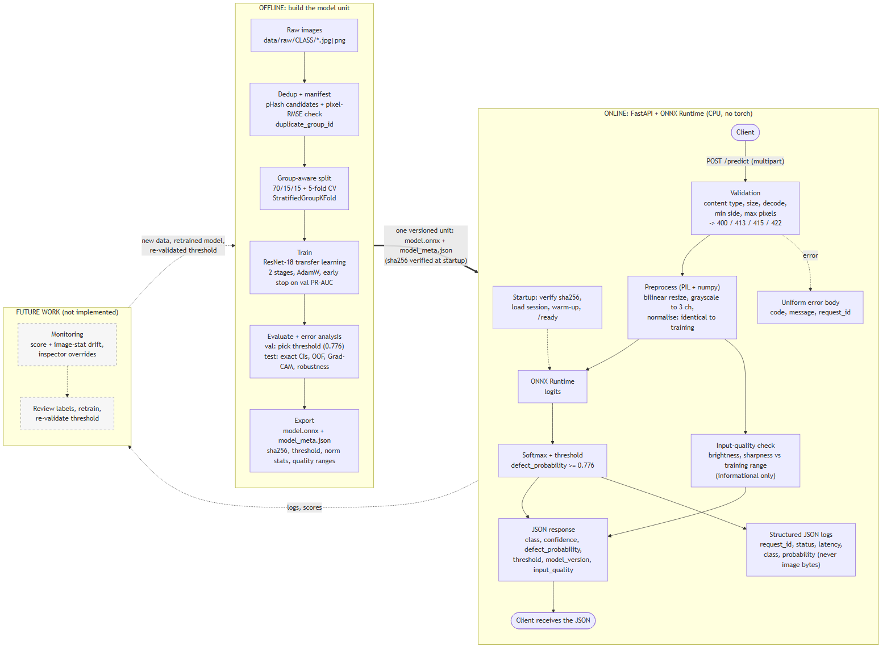
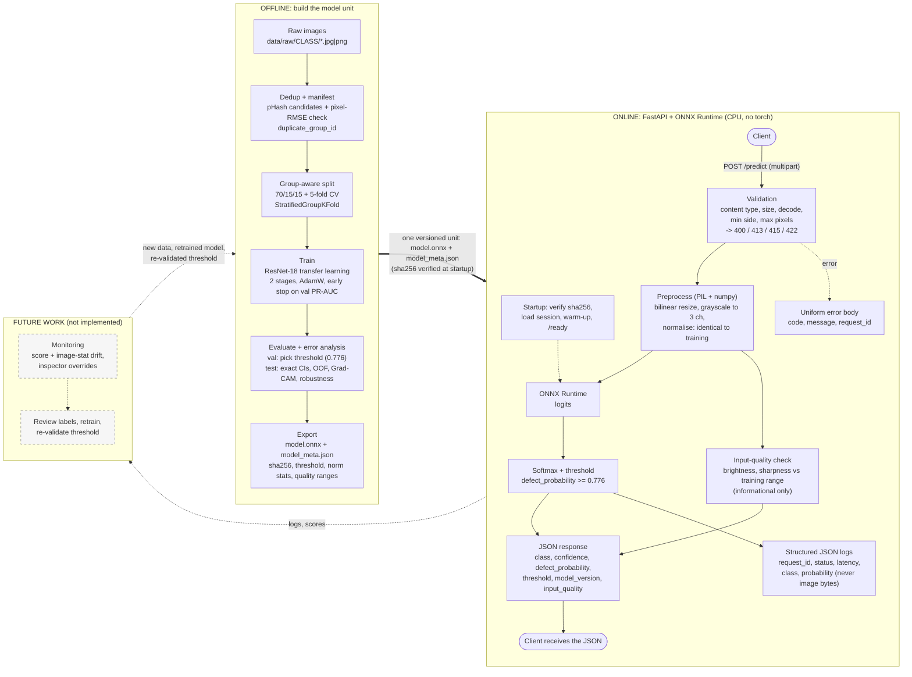

# Architecture

Two flows share one artifact: the **offline** pipeline builds a versioned model unit (`model.onnx` + `model_meta.json`), the
**online** service loads exactly that unit. The dashed boxes and arrows are **future work, not implemented**.



*(The PNG was rendered from the Mermaid diagram below.)*

## Mermaid source

GitHub renders this block natively:



## What each stage is, and where it lives

| stage | what happens | code / output |
|---|---|---|
| Dedup + manifest | pHash proposes near-duplicate pairs, a pixel-RMSE check confirms them, every image gets a `duplicate_group_id` | `scripts/prepare_standin_dataset.py`, `scripts/_common.py`; `reports/dataset_inspection.txt` |
| Group-aware split | `StratifiedGroupKFold` folds are assigned to train/val/test (70/15/15) and to 5 CV folds; no group crosses a split | `src/defect_detection/data.py`, `scripts/make_splits.py`; `reports/dataset_summary.json` |
| Train | ResNet-18 (ImageNet weights), head-only stage then full fine-tune, early stopping on validation PR-AUC | `src/defect_detection/train.py`; `reports/training_runs.md` |
| Evaluate + error analysis | threshold chosen on validation only; test read once; exact CIs, out-of-fold predictions, Grad-CAM, calibration, robustness | `src/defect_detection/evaluate.py`, `error_analysis.py`; `reports/model_comparison.md`, `reports/error_analysis.md` |
| Export | ONNX (opset pinned) + metadata (threshold, normalisation, quality ranges, sha256); parity check against PyTorch | `src/defect_detection/export.py`; `reports/export_parity.json` |
| Validation | content type, size, decode, minimum side, maximum pixel count; one error body for every failure | `api/main.py`, `api/service.py` |
| Preprocess | torch-free; PIL bilinear resize (not cv2), grayscale to 3 channels, normalise; bit-identical to the training transform | `src/defect_detection/preprocess.py`; `reports/preprocess_equivalence.json` |
| Inference + threshold | ONNX Runtime on CPU, softmax, `defect_probability >= threshold` (0.776) | `api/service.py` |
| Input-quality check | brightness and sharpness against the 1st-99th training percentiles; informational, never alters the prediction | `src/defect_detection/preprocess.py` |
| Logs | one JSON object per request: id, status, latency, class, probability, warnings (no image bytes) | `api/logging_config.py` |

## Re-rendering the diagram

Copy the Mermaid block above (without the fences) into a file, for example `diagram.mmd`, and render it:

```bash
npx -y @mermaid-js/mermaid-cli@11.4.2 -i diagram.mmd -o docs/architecture.png -s 2 -b white
```
(On a machine with Chrome but no Puppeteer browser download, add `-p puppeteer.json` with `{"executablePath": "<path to chrome>", "args": ["--no-sandbox"]}`.)
