# Error analysis, calibration and robustness (Step 3)

> **Stand-in dataset.** Kaggle casting images, subsampled to 700 (18% defective). Nothing here transfers to the client's data. Several findings below are about *how fragile a pipeline is on a small sample*, which does carry over.

**Model:** ResNet-18 @224, no imbalance handling (`artifacts/best.pt`), validation-tuned threshold **0.776**.

## 0. Scope and provenance

- `reports/oof_predictions.csv` holds **595 images (488 normal, 107 defective), not 700**. CV runs on train+val only so the 105 test images stay untouched. All OOF analysis below uses these 595.
- Step 2 did not save the fold models. I re-trained the 5 folds with identical seeds/schedule and saved them (`scripts/cv_save_folds.py`). They reproduce the Step 2 OOF probabilities (max |Δp| = 2.9e-8, 0 of 595 decisions flipped at 0.5; `reports/oof_reproduction_check.json`). So every Grad-CAM, logit and per-fold statistic below comes from the exact model that made the prediction.
- OOF analysis (sections 1–4, 6) never touches the test set. Section 7 (robustness) reads the test images, read-only, with nothing re-tuned.
- Per-fold models are *different networks*; the deployed model (`best.pt`) is a separate run trained on the train split with early stopping on validation. OOF results describe the training recipe, not the deployed weights.

## Top findings

1. **Fold 2's 25 false positives are a calibration offset of that fold's model, not an ordering problem.** Its PR-AUC is 1.000 (all defects z ≥ 5.50, all normals z ≤ 3.07), but its normals' median logit margin is −1.60 versus −4.25 for the other folds (+2.65). The same fold-2 model also scores 95 of its own 390 *training* normals above 0.5, so the offset belongs to the model, not to the held-out images.
2. **Two defects are missed with high confidence** (`cast_def_0_6988`, p = 0.024; `cast_def_0_2949`, p = 0.118), both in fold 0. I could not see a defect in either by eye, and Grad-CAM does not point at an identifiable flaw. They are also the only errors that are not fixable by moving the threshold.
3. **The model is brittle to input noise and blur, and to brighter images**, mostly as *false alarms* (noise σ=25: precision 0.22 at 0.5; blur σ=2: 0.50), plus missed defects when brightness is ×1.3 (recall 0.842 at the tuned threshold). Rotations by 90/180° and contrast/brightness-down changes cause no errors.

---

## 1. Error inventory (OOF, 595 images)

Full list: `reports/errors.csv` (filename, fold, probability, true label, threshold, FP/FN).

| threshold | FP | FN | FP by fold (0–4) | FN by fold (0–4) |
|---|---|---|---|---|
| 0.5 | 33 | 2 | 0 / 6 / **25** / 1 / 1 | 2 / 0 / 0 / 0 / 0 |
| 0.776 (Step 2, validation-tuned) | 7 | 2 | 0 / 1 / **5** / 1 / 0 | 2 / 0 / 0 / 0 / 0 |

- False negatives (identical at both thresholds): `cast_def_0_6988.jpeg` (fold 0, p = 0.024) and `cast_def_0_2949.jpeg` (fold 0, p = 0.118).
- Seven false positives remain at 0.776: `cast_ok_0_4994` (fold 3, p=0.978), `7597` (f2, 0.955), `5314` (f2, 0.932), `973` (f2, 0.879), `8124` (f2, 0.849), `4862` (f2, 0.816), `1883` (f1, 0.778).

Galleries (tuned threshold is used to define "true positive/negative"):

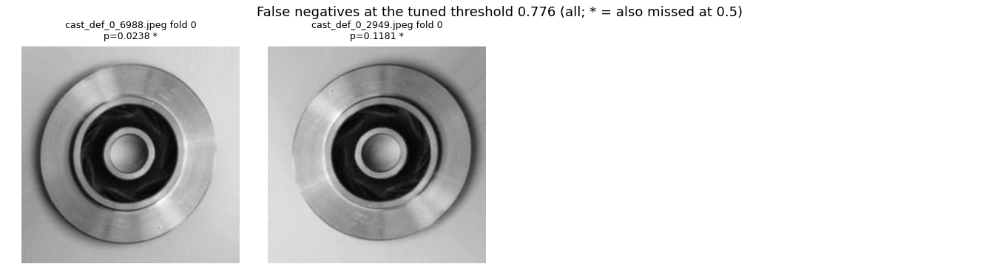
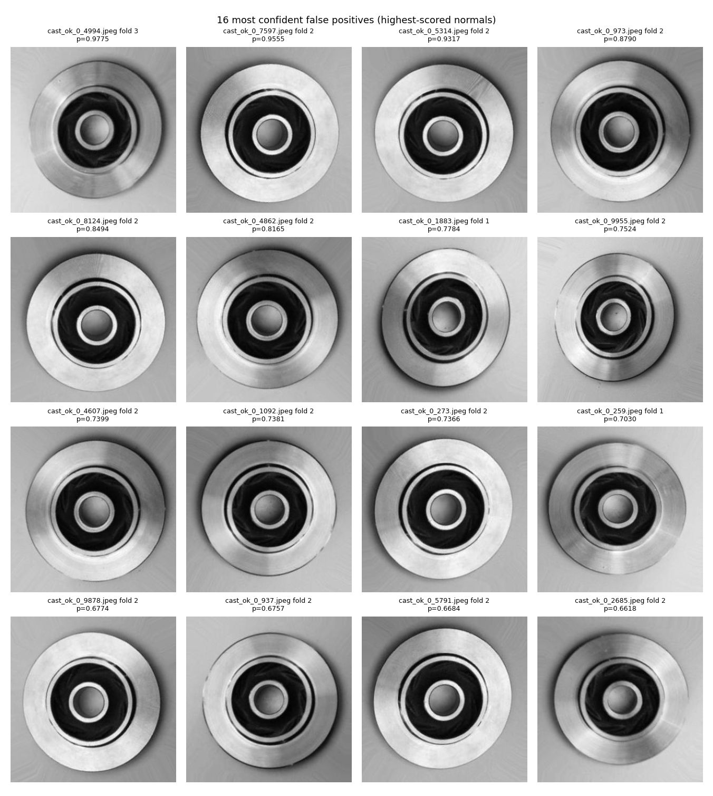
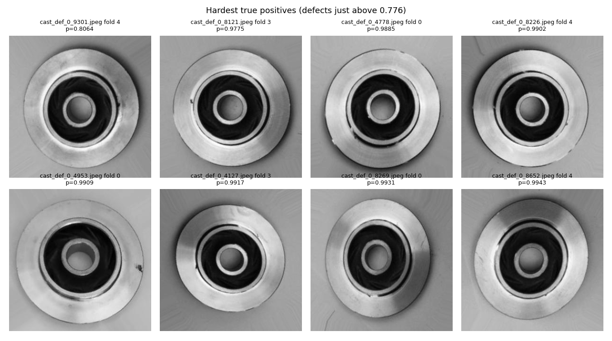
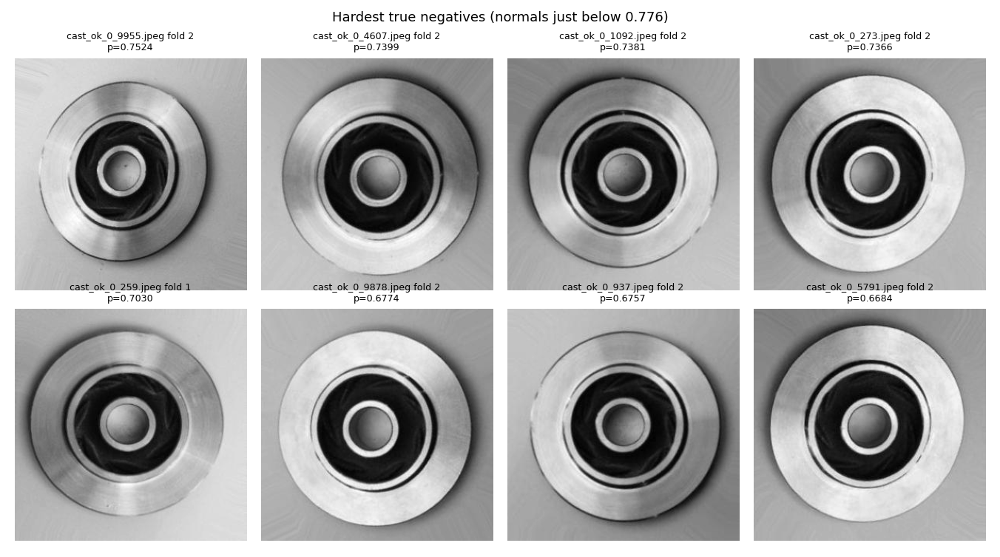

Per-fold confusion matrices and score distributions:

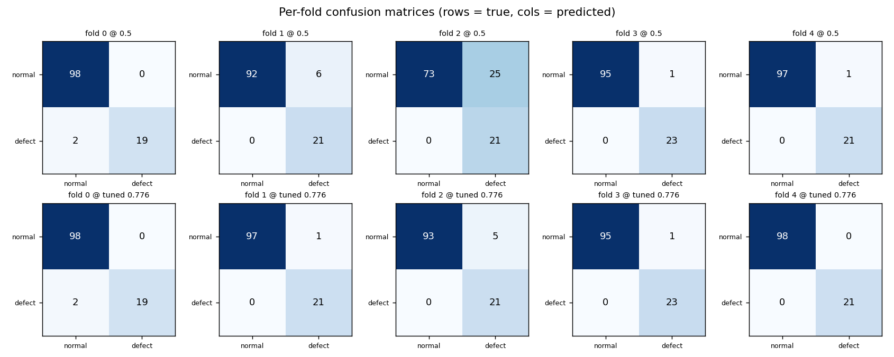
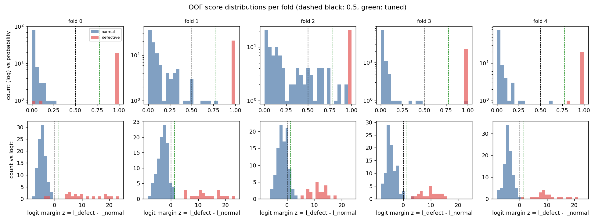

## 2. Fold 2: perfect PR-AUC, 25 false positives at 0.5

Per-fold numbers (`reports/per_fold_table.csv`; z = logit margin defect − normal, so p = 0.5 ⇔ z = 0):

| fold | PR-AUC | median z normals | max z normals | median z defects | min z defects | FP@0.5 | FN@0.5 | Brier |
|---|---|---|---|---|---|---|---|---|
| 0 | 0.963 | −4.71 | −0.98 | 8.17 | **−3.71** | 0 | 2 | 0.017 |
| 1 | 1.000 | −2.74 | 1.26 | 12.16 | 5.22 | 6 | 0 | 0.040 |
| 2 | 1.000 | **−1.60** | 3.07 | 11.31 | 5.50 | **25** | 0 | 0.122 |
| 3 | 0.998 | −4.87 | 3.77 | 9.72 | 3.77 | 1 | 0 | 0.014 |
| 4 | 1.000 | −4.23 | 0.43 | 9.09 | 1.43 | 1 | 0 | 0.006 |

What the numbers say:

- **Ranking is fine.** In fold 2 every defect scores above every normal (gap of 2.44 logits). Any threshold with p between 0.955 and 0.996 would classify fold 2 perfectly. 0.5 simply sits inside the normals' tail.
- **The whole normal distribution is shifted, not just a tail.** Fold-2 normals vs normals of the other folds: median z −1.60 vs −4.25 (shift +2.65; Mann-Whitney p < 0.0001, rank-biserial 0.67). The shift is roughly uniform across quantiles (10th: −3.79 vs −6.19; median −1.60 vs −4.25; 90th: 0.74 vs −1.60). Normals' z differs across the five folds (Kruskal-Wallis p < 0.0001).
- **Defects are not shifted.** Fold-2 defects median z 11.31 vs 10.00 for the rest (p = 0.25); across folds p = 0.14. So it is a bias on the normal side (a logit offset), not a change in how separable the classes are.
- **The offset belongs to the model, not the held-out images.** For each fold I scored the model's own *training* normals:

  | fold model | median z, held-out normals | median z, its training normals | training normals above 0.5 |
  |---|---|---|---|
  | 0 | −4.71 | −4.65 | 0 / 390 |
  | 1 | −2.74 | −2.91 | 20 / 390 |
  | 2 | **−1.60** | **−1.37** | **95 / 390 (24%)** |
  | 3 | −4.87 | −4.76 | 1 / 392 |
  | 4 | −4.23 | −4.43 | 4 / 390 |

  Held-out and training medians agree closely in every fold. The fold-2 model is biased toward "defect" on data it was trained on too.
- **Fold-2 images are not unusual.** Its normals do not differ from other normals on brightness, contrast, sharpness, background level, hole size or hole offset (all p > 0.2; `reports/fold2_normals_features.csv`), and its train/held-out class counts match the other folds (390/86 train; 98/21 held-out).

**Hypothesis (not tested):** each CV fold uses the weights at the end of a truncated cosine schedule (epoch 5 of an 8-epoch schedule, LR still high) with no checkpoint selection, so the bias of the normal class varies between seeds/folds. The deployed model differs: its epoch was chosen on validation, and on validation its highest-scored normal is p = 0.080 against a lowest defect of 0.993, with no sign of such an offset. Distinguishing this from other causes would need repeated runs with different seeds and an LR/epoch sweep; I did not run them.

**Consequence:** the Step 2 "OOF precision @0.5 = 0.76" is mainly one badly-biased fold model. It should be read as *training-recipe variance in calibration*, not as the expected precision of the deployed model.

## 3. Grad-CAM (layer4[-1], defect-class logit, exact fold model)

Per-image panels: `figures/gradcam/` (`FN_*`, `FP_*`, `TP_*`); coordinates in `reports/gradcam_summary.csv`. Limits to keep in mind: the map is 7×7 cells (one cell ≈ 43 px of the 300 px image, ~14% of the width), there are **no pixel-level defect annotations**, so I cannot compute a localisation score; what follows is what I could see, and the explanations are hypotheses.

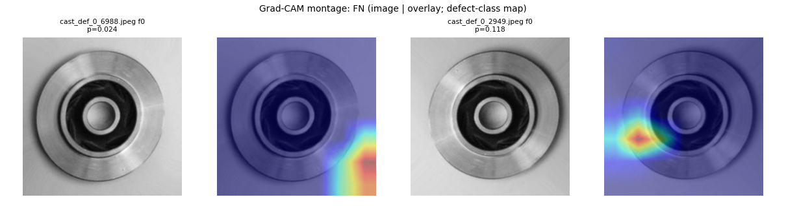
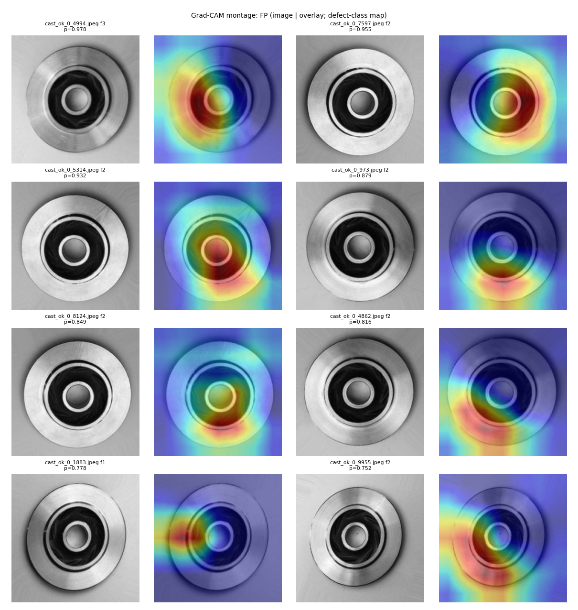
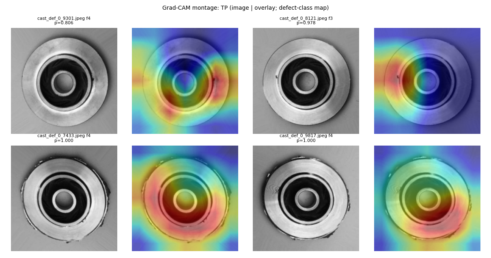

**False negatives** (both fold 0)
- `cast_def_0_6988` (p = 0.024): at native resolution the part looks undamaged to me; I could not identify a defect (possibly tiny specks on the lower-right rim, uncertain). The heat is in the lower-right corner of the image, on the grey background outside the part (peak at cell ≈ (279, 236) px).
- `cast_def_0_2949` (p = 0.118): I could not identify a defect either (a faint speck near the upper-left rim, uncertain). The heat blob sits on the left edge of the part's outer ring at ≈ (64, 192) px, not at that speck.
- *Hypotheses:* the defect is too subtle at 224 px for this model; or the image is mislabelled in the source data; or the model keys on cues unrelated to the visible part. I cannot distinguish these.

**False positives** (8 most confident; 6 are fold 2)
- Attention is diffuse: large areas over the central bore/inner ring and about half of the disk, often with a sharp left/right or diagonal boundary (`4994`, `7597`), or along the lower rim (`973`, `8124`, `4862`). `1883` peaks on the far left, partly outside the part. None looks like a localised spot on a visible flaw, and the parts look normal to me.
- *Hypothesis:* these scores come from a global bias (section 2) acting on broad features rather than from a detected flaw. Not proven.

**True positives**
- Confident (`7433`, `9817`, p = 1.000): the rim is visibly ragged or damaged; heat is broad over the rim and disk, including the damaged regions but also the bore.
- Hardest (`8121` p = 0.978, `9301` p = 0.806): a small dark notch/blemish on the left rim (`8121`) and on the right rim (`9301`); in both, a hot region overlaps the blemish, alongside other hot areas.

Summary: for correct detections the heat overlaps visible rim damage (broadly); for false positives it is diffuse; for the two false negatives it does not land on anything I can identify as a defect. With 14 images and subjective reading this is illustrative, not a validated explanation.

## 4. Image properties vs outcome (`reports/image_features.csv`)

Features per image: mean brightness, contrast (std), sharpness (Laplacian variance), background level (border mean), and pose/position proxies from the dark central hole (its radius ≈ part scale, and centroid offset from the image centre). These are crude proxies; there is no true pose estimate.

- **FP vs TN (33 vs 455 at 0.5; 7 vs 481 at 0.776):** no feature differs after Benjamini-Hochberg correction (best raw p = 0.023 for sharpness, adjusted 0.135; rank-biserial 0.24). 25 of the 33 FPs come from one fold model, so these are not independent samples, and the comparison is confounded by fold.
- **FN vs TP (2 vs 105):** **too few errors to conclude anything.** For the record, both FNs have low sharpness (78 vs a TP median of 197; a 25th percentile of 139 across all defects) and a bright background (190 vs 159; a 75th percentile of 168), and the two images have near-identical feature vectors (brightness 151.9 / 152.1, contrast 59.8 / 60.1, sharpness 78.4 / 78.6, background 191 / 190, hole radius 57.4 / 57.4). Mann-Whitney p-values for these are as small as 0.001, but n = 2 makes them meaningless as evidence. A **hypothesis:** they share an acquisition condition (soft focus, bright background). It is consistent with section 7 (brightness ×1.3 lowers defect scores) but it is not established.
- **Association of score with features (more data, still exploratory)** (`reports/score_vs_feature_spearman.csv`; 24 tests, no multiplicity correction):
  - Normals: z correlates positively with background (ρ = 0.21, p < 0.001) and negatively with sharpness (−0.16), contrast (−0.15) and hole radius (−0.16); without fold 2 these are stronger (background 0.31, sharpness −0.29).
  - Defects: z correlates positively with sharpness (ρ = 0.37, p < 0.001) and negatively with hole radius (−0.47, p < 0.001).
  - Sharpness has *opposite* signs for normals and defects (blurrier normals score higher, blurrier defects score lower), so this is not a coherent "image quality" effect. Hole offset (position) is unrelated for normals (ρ = 0.01).
  - Correlations are descriptive and could reflect confounders (e.g. part size, acquisition batch).

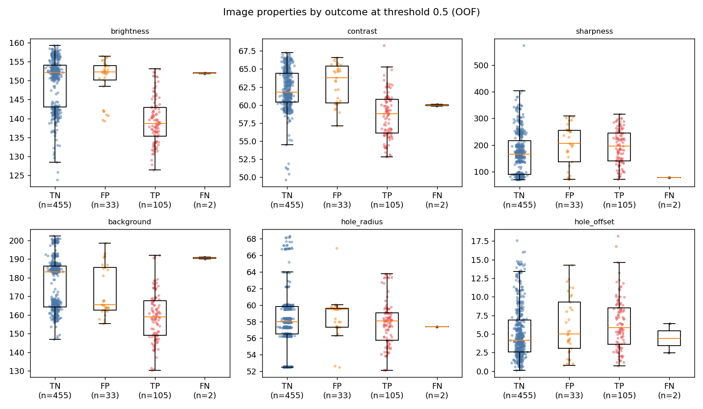

## 5. Thresholds and calibration (OOF only)

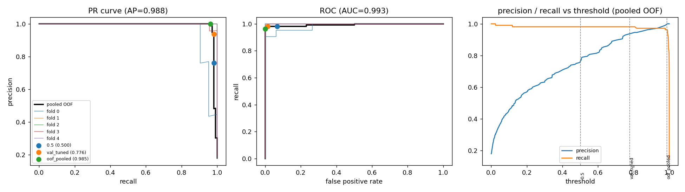

**Calibration.** Brier 0.040 pooled; per fold 0.017, 0.040, **0.122**, 0.014, 0.006. ECE 0.083 pooled; per fold 0.010, 0.112, **0.231**, 0.037, 0.033. The scores are strongly bimodal, so the middle bins hold few images (and contain only normals). Fold-to-fold spread is the main calibration problem.

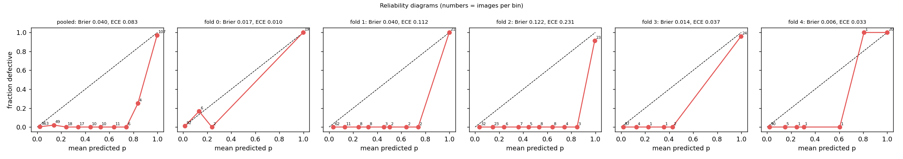

**Candidate thresholds** (pooled OOF, 107 defective / 488 normal; exact 95% intervals; `reports/candidate_thresholds.csv`):

| threshold | TP | FP | FN | recall [95% CI] | precision [95% CI] | cost 1:1 | 5:1 | 10:1 | 50:1 |
|---|---|---|---|---|---|---|---|---|---|
| 0.5 | 105 | 33 | 2 | 0.981 [0.934, 0.998] | 0.761 [0.681, 0.829] | 35 | 43 | 53 | 133 |
| **0.776** (Step 2, validation) | 105 | 7 | 2 | 0.981 [0.934, 0.998] | 0.938 [0.875, 0.975] | 9 | **17** | **27** | **107** |
| 0.985 (pooled OOF, recall ≥ 0.95; *in-sample*) | 103 | 0 | 4 | 0.963 [0.907, 0.990] | 1.000 [0.965, 1.000] | **4** | 20 | 40 | 200 |
| leave-one-fold-out threshold (honest estimate of "choose on OOF") | 102 | 0 | 5 | 0.953 [0.894, 0.985] | 1.000 [0.964, 1.000] | 5 | 25 | 50 | 250 |

Cost columns are `ratio × FN + FP` for illustrative cost(missed defect) : cost(false alarm) ratios; they are scenarios, not estimates of any real cost. The pooled-OOF threshold is selected and evaluated on the same predictions, so its row is optimistic; the leave-one-fold-out row selects each fold's threshold on the other four folds and is the fair comparison.

**Recommendation: keep the Step 2 validation-tuned threshold (0.776) for the deployed model**, because:
- it was derived from the deployed model's *own* validation scores; a pooled-OOF threshold mixes five different networks with different offsets (section 2), and 0.985 is driven by the worst-biased folds. It is not transferable to `best.pt`;
- it has the lowest cost of the four candidates for every illustrative ratio of 5:1 and above, and it misses 2 defects against 4–5 for the OOF-derived thresholds; those thresholds only come out ahead at 1:1, where a missed defect costs no more than a false alarm;
- the cost-minimising threshold on OOF is 0.806 for ratios 5:1 to 50:1 and 0.978 for 1:1, i.e. close to 0.776 in the cases that matter.

**Caveats:** (i) no tuned threshold reaches recall ≥ 0.95 *with certainty* (lower bound 0.93 at 0.776); (ii) the two false negatives are missed by every candidate, and catching both would need a threshold of about p = 0.024, which would flag 245 of the 488 normals (50%); (iii) the fold analysis shows the normal-class offset can move by about ±2.6 logits between training runs, so **the threshold must be re-validated whenever the model is retrained or the capture setup changes.**

**Business trade-off.**
- A missed defect (false negative) ships a bad part: scrap, rework, warranty or safety exposure. A false alarm sends a good part to a human inspector: minutes of labour and some throughput loss. In most inspection settings the first is far more expensive, which argues for a recall-favouring threshold (as here).
- Precision depends heavily on prevalence, and this stand-in has an artificial 18%. Holding recall (0.981) and false-positive rate (7/488 = 1.43%) at the 0.776 operating point, the implied precision (a calculation, not a measurement) is 0.94 at 18% defective, **0.78 at 5%, 0.58 at 2%, 0.41 at 1%**, i.e. about 1.5 false alarms per real defect at 1% prevalence. At threshold 0.5 (FPR 6.8%) it would be 0.43, 0.23 and 0.13 at 5%, 2% and 1%. The real defect rate must be known before sizing the inspection workload.

**Temperature scaling** (fitted on validation only, applied to the OOF logits): **degenerate**. The validation set is perfectly separable, so NLL falls monotonically as T shrinks and the fit hits its lower bound (T = 0.05; NLL 7e-24). Applying it: Brier worsens 0.040 → 0.052 (fold 2: 0.122 → 0.188), FPs at the 0.776 probability cut rise 7 → 27, and, as it must, FPs at p = 0.5 are unchanged (33; fold 2: 25). That last point is general: a single temperature rescales logits and cannot move the p = 0.5 boundary, so it cannot repair a *bias*. (PR-AUC is unchanged at 0.9881 when computed on the logits; a naive PR-AUC on the saturated probabilities, 523 of which round to exactly 0 or 1, would wrongly show 0.952.) A bias term (Platt scaling) fitted per model on that model's own held-out data would be the relevant fix; I did not fit it, because it would need a clean calibration split per model.

## 6. Statistics

Recall and precision use exact Clopper-Pearson 95% intervals; F1/AUC use a percentile bootstrap (1,000 resamples).

| set / threshold | recall | precision | F1 (bootstrap) |
|---|---|---|---|
| **Test**, 0.5 and 0.776 | 19/19 = 1.000 [0.824, 1.000] | 19/19 = 1.000 [0.824, 1.000] | 1.000 [1.00, 1.00], **degenerate** |
| OOF, 0.5 | 105/107 = 0.981 [0.934, 0.998] | 105/138 = 0.761 [0.681, 0.829] | 0.857 [0.808, 0.899] |
| OOF, 0.776 | 105/107 = 0.981 [0.934, 0.998] | 105/112 = 0.938 [0.875, 0.975] | 0.959 [0.930, 0.982] |
| OOF, 0.985 (in-sample) | 103/107 = 0.963 [0.907, 0.990] | 103/103 = 1.000 [0.965, 1.000] | 0.981 [0.963, 0.996] |

AUCs: test PR-AUC and ROC-AUC are 1.000 with a **degenerate** bootstrap (zero-width interval: every resample is perfect, so it says nothing about uncertainty). OOF PR-AUC 0.988 [0.971, 1.000], ROC-AUC 0.993 [0.982, 1.000] (not degenerate). With 19 defects, "perfect" on test is still compatible with a true recall as low as ≈ 0.82. `reports/model_comparison.md` now uses the same intervals.

## 7. Robustness on the test set (read-only, nothing re-tuned)

105 test images (19 defective). Perturbations are applied to the raw 300×300 image before the usual resize/normalise. Noise σ is on the 0–255 scale; one noise seed. Thresholds are fixed (0.5 and 0.776). Intervals are exact; with 19 defects the recall intervals are wide. Source: `reports/robustness.csv`, `figures/robustness_examples.png` shows each perturbation.

| condition | recall @0.5 | precision @0.5 | recall @0.776 | precision @0.776 | FN / FP @0.5 | FN / FP @0.776 | PR-AUC | mean p, normals |
|---|---|---|---|---|---|---|---|---|
| clean | 1.000 | 1.000 | 1.000 | 1.000 | 0 / 0 | 0 / 0 | 1.000 | 0.009 |
| brightness ×0.7 | 1.000 | 1.000 | 1.000 | 1.000 | 0 / 0 | 0 / 0 | 1.000 | 0.047 |
| **brightness ×1.3** | 0.947 | 1.000 | **0.842** | 1.000 | 1 / 0 | **3 / 0** | 1.000 | 0.002 |
| contrast ×0.7 | 1.000 | 1.000 | 1.000 | 1.000 | 0 / 0 | 0 / 0 | 1.000 | 0.006 |
| contrast ×1.3 | 1.000 | 0.950 | 1.000 | 1.000 | 0 / 1 | 0 / 0 | 1.000 | 0.029 |
| blur σ=1 | 1.000 | 1.000 | 1.000 | 1.000 | 0 / 0 | 0 / 0 | 1.000 | 0.027 |
| **blur σ=2** | 1.000 | **0.500** | 0.947 | **0.720** | 0 / **19** | 1 / 7 | 0.973 | 0.310 |
| noise σ=10 | 1.000 | 0.864 | 1.000 | 0.950 | 0 / 3 | 0 / 1 | 1.000 | 0.098 |
| **noise σ=25** | 1.000 | **0.218** | 1.000 | **0.380** | 0 / **68** | 0 / **31** | 0.978 | 0.659 |
| rotate 90° | 1.000 | 1.000 | 1.000 | 1.000 | 0 / 0 | 0 / 0 | 1.000 | 0.005 |
| rotate 180° | 1.000 | 1.000 | 1.000 | 1.000 | 0 / 0 | 0 / 0 | 1.000 | 0.006 |
| JPEG q30 | 1.000 | 0.864 | 1.000 | 0.950 | 0 / 3 | 0 / 1 | 1.000 | 0.094 |

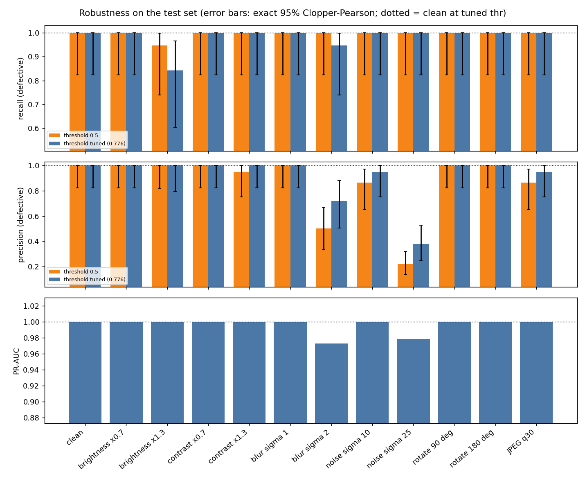

What hurts, in order of severity:
1. **Gaussian noise σ=25**: 68 of 86 normals flagged at 0.5 (31 at 0.776). The mean normal score rises from 0.009 to 0.659 while ROC-AUC stays 0.995, so ranking is largely kept but scores shift upward.
2. **Blur σ=2**: 19 / 7 false positives, mean normal score 0.31, PR-AUC 0.973 (a defect also drops below 0.776).
3. **Brightness ×1.3**: the only perturbation that causes *misses* (1 at 0.5, 3 at 0.776); mean defect score 0.999 → 0.877.
4. **Noise σ=10 and JPEG q30**: mild (3 false positives at 0.5, 1 at 0.776).

Unaffected: rotation by 90/180° (training included flips and ±15° rotations), contrast ×0.7, brightness ×0.7, blur σ=1 (contrast ×1.3 gives one false positive at 0.5).

Reading: perturbations that add high-frequency texture or degrade edges mostly *raise the score of normal parts*, the same kind of failure as fold 2 (an upward shift of the normal class). That is an interpretation of the numbers, not a tested cause. The pipeline's fixed threshold is therefore the fragile element under capture-quality drift, more than the ranking.

## 8. Known weaknesses and limitations

- **Two confident misses** with no visible cause (section 3); defect types the model cannot see are unknown.
- **Calibration is unstable across training runs** (fold offset spread ≈ 2.6 logits; Brier 0.006–0.122); a fixed threshold is not safe across retrains.
- **Sensitive to noise, blur and brighter images** (section 7); a different camera, focus or lighting could shift scores.
- **Small statistics:** 107 defects OOF, 19 on test (exact lower bound on test recall 0.82). The 595 OOF images come from 5 models of one recipe, so folds are not independent estimates of the deployed model.
- **No defect annotations or defect-type labels,** so Grad-CAM cannot be scored, and I cannot report per-defect-type recall.
- **Grad-CAM at 7×7** is too coarse to localise small defects; visual descriptions are subjective.
- **Image-property analysis is exploratory** (proxies only; n = 2 for false negatives).
- **Stand-in data:** clean, uniform acquisition; 18% prevalence is artificial; a pixel logistic regression already reaches 0.97 test PR-AUC. Real data will probably be harder and less balanced.
- **No duplicate groups in the subsample,** so near-duplicate leakage was not exercised end to end (the split code is unit-tested for it).
- **Not tested:** other seeds, a longer or differently scheduled CV (the fold-2 hypothesis), Platt scaling, higher resolution, other architectures for this analysis.

## 9. What I would do with more / real data

- **More defects, and defect-type labels with bounding boxes or masks:** enables per-type recall, pixel-level Grad-CAM scoring, and checking whether the 2 missed images are a defect type the model never learned or label noise (have a second inspector re-label them).
- **Hard-negative mining** from false positives (the fold-2 type) and **hard-positive review** from misses; retrain with them and watch calibration across seeds.
- **Higher-resolution inputs or tiled/rim crops** (the defects are small and rim-local) with a larger feature map, so localisation and subtle defects improve; compare cost vs latency.
- **Anomaly-detection comparison** (e.g. PatchCore or autoencoder-style models trained on normals only), to cover defect types absent from training and to cope with very low prevalence.
- **Calibration protocol:** hold out a calibration split per deployed model; fit Platt (bias + slope) or isotonic there; choose the threshold from the target recall with an exact lower bound; repeat over several seeds and report the spread.
- **Augmentation/robustness training** with noise, blur and brightness changes within the real camera's range, and test-time checks on the failures in section 7; **checkpoint selection by validation calibration** and seed ensembles to reduce the offset variance.
- **Active-learning loop:** send low-margin and high-disagreement images to inspectors, fold labels back, retrain on a schedule.
- **Drift monitoring in production:** track the score distribution (mean score on accepted parts, fraction above threshold), image statistics (brightness, sharpness, noise level) and inspector overrides; alert when the normal-class score distribution shifts, since section 2 and section 7 show that this is the failure mode here. Re-validate the threshold after any camera, lighting or model change.

## Reproduce

```bash
python scripts/cv_save_folds.py      # re-train the 5 CV folds with saved weights, verify against Step 2 OOF
python scripts/error_analysis.py     # sections 1, 2, 4, 5, 6 (OOF only)
python scripts/gradcam.py            # section 3
python scripts/robustness.py         # section 7 (test set, read-only)
python scripts/evaluate.py --skip-cv # refresh reports/model_comparison.md with exact intervals
```
Numbers: `reports/error_analysis_results.json`, `reports/robustness_results.json`, CSVs in `reports/`.
